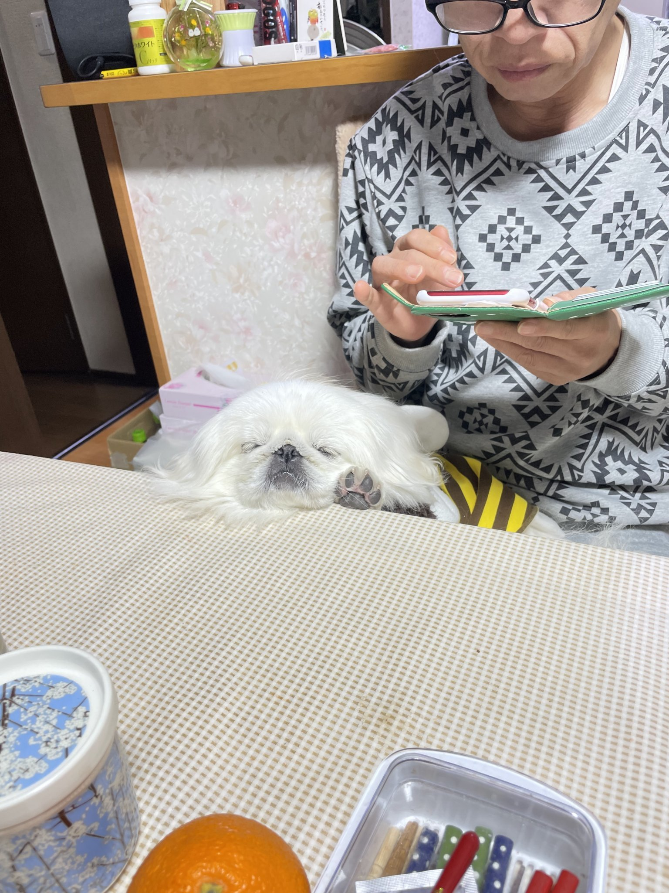
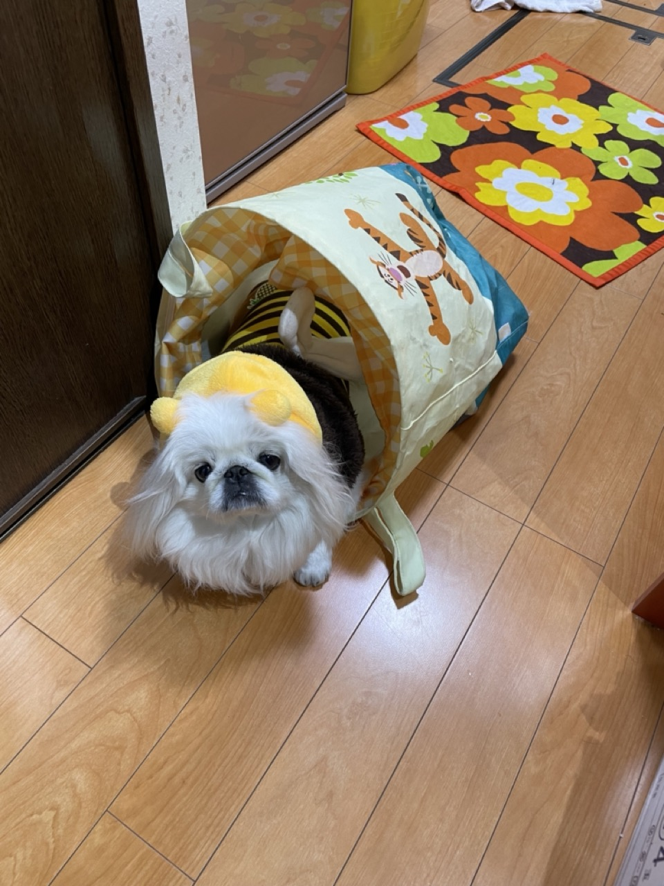

# メディアクエリ(レスポンシブデザイン)

まずは、このレポジトリのこの章にある、index.html をブラウザで開いてみてほしい。

次に Chrome で検証(Developer)ツールを開き、検証ツールの左上にあるスマホアイコンをクリックする。そして、画面の横サイズをを変えていくと、ある横幅になったときに画像の並びが横から縦に変わる。


このように、デバイスの横幅やブラウザの横幅に応じて変わるデザインのことをレスポンシブデザインと呼ぶ。スマホやタブレットが普及した現在、会社の Web サイト(コーポレートサイト)やプロモーション用のサイト(LP)は様々な横幅を持つデバイスで見られることが当たり前になってきたため、レスポンシブデザインの重要性が高まっている。

それぞれのデバイスごとに複数のバージョンの HTML、CSS、JS 　を作らずに、１つの HTML、CSS、JS で複数の画面幅に対応するために、2 つの CSS の機能、flex や grid などの整列整列系 CSS とメディアクエリを駆使する。

- 表示されている画像などの配列を、画面サイズに応じて、横持ちから縦持ちに変えるため flex や grid を使う
- ある一定サイズの画面幅に達したときに、同じ CSS のクラス名でも違う設定をすることができるメディアクエリを使う

flex は他の章で説明した。ここではメディアクエリの解説をする。

## メディアクエリ

`style.css`を覗いてみると、見慣れない CSS の記述があると思う。これだ。

```css
@media (max-width: 768px) {
  .image-list {
    display: flex;
    flex-direction: column;
    align-items: center;
    gap: 16px;
  }
}
```

`@media(max-width: 768px){}`の波括弧{}の中に`.image-list`クラスに対する CSS が記述されている。ところで、`.image-list`自体は、この記述の上にすでに記述されている。

```css
/* 〜省略〜 */

/* image-listクラスの設定が2つ！？ */
.image-list {
  display: flex;
  justify-content: space-between;
  gap: 16px;
}

.container {
  padding-left: 20px;
  padding-right: 20px;
}

@media (max-width: 768px) {
  /* image-listクラスの設定が2つ！？ */
  .image-list {
    display: flex;
    flex-direction: column;
    align-items: center;
    gap: 16px;
  }
}
```

なんとなく想像がついたかもしれないが、これが画面幅に応じて CSS の設定を変える仕組みである。HTML には、各画像ととタイトルを持ったカードの配列があり、その配列を`image-list`クラスをもった`div`タグでまとめている。

```html
<h2>動物に擬態</h2>
<div class="image-list">
  <div class="card">
    
    <div class="card-body title">招き猫</div>
  </div>
  <div class="card">
    
    <div class="card-body title">ハチ</div>
  </div>
  <div class="card">
    
    <div class="card-body title">ポン・デライオン</div>
  </div>
</div>
```

この`image-list`にはデフォルトでこのスタイルが適用される。flex で等間隔に並べ隙間は最低 16px あける。

```css
.image-list {
  display: flex;
  justify-content: space-between;
  gap: 16px;
}
```

そして、この`@media`から始まるものの正体だが、これはメディアクエリと呼ばれ、特定の条件を満たすと、デフォルトのスタイルを上書きする。[特定の条件にはいろいろ指定できる。](https://developer.mozilla.org/ja/docs/Web/CSS/Media_Queries/Using_media_queries)
今回はここに画面の横幅を条件に指定した。この書き方だと、横幅が 768px 以下にはこのスタイルで上書きするという条件。

```css
/* 横幅768px以下で適用される */
@media (max-width: 768px) {
  /* ここに上書きするcss */
}
```

ここで、画面幅が 768px 以下のとき`flex-direction`を`column`にしている。つまり、配列の向きを縦にしている。レスポンシブデザインはこれだけで実現できる。ぜひ挑戦してみてほしい。

```css
/* 横幅768px以下で適用される */
@media (max-width: 768px) {
  .image-list {
    display: flex;
    flex-direction: column;
    /* 真ん中中央寄せ */
    align-items: center;
    gap: 16px;
  }
}
```

ちなみに、ここででてきた 768px などのちょうどスタイルが変わる横幅はブレークポイントと呼ばれる。ブレークポイントをどこに設定するかは難しい問題で、世の中に出回っている、スマホやタブレットや PC のサイズで一番普及している画面サイズを設定することが多い。

詳しくは「メディアクエリ　ブレークポイント」で調べてみてほしい。ちなみにスマホだと、２年前だと 320px だったが、今は 370px 前後ぐらいかなと思う。
