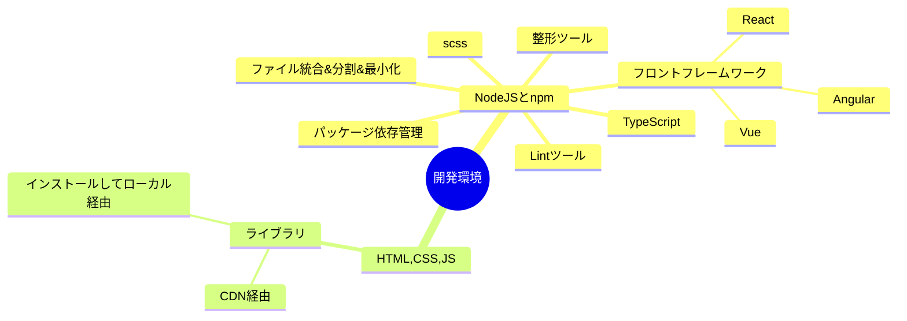

NodeJS のちからを借りて、素の HTML,CSS,JS よりも強力に開発できる。

NodeJS のメリット

- npm というパッケージマネージャ(ライブラリを管理してくれるやつ)を利用できるため、ライブラリのインストールや依存管理が容易
- ライブラリと VSCode の拡張機能を使ってコマンドで整形や lint を実行できるためコードの品質を一定に保てる
- CSS の強化版である SCSS や JS の強化版である TypeScript を使える
- フロントフレームワークの能力を最大限引き出せる

